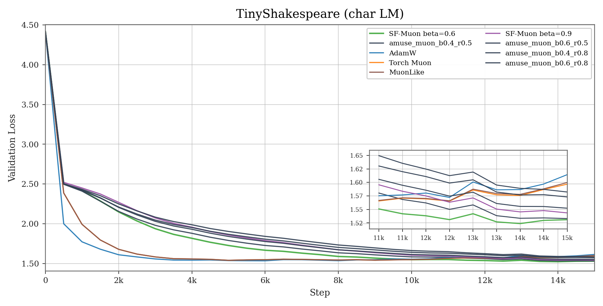
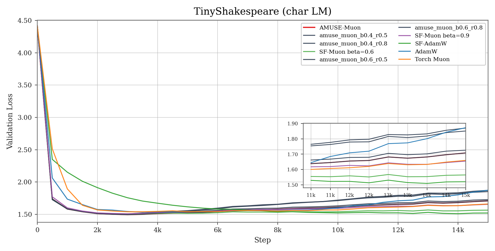

# muon experiments

small experimental workspace for muon-style optimizer kernels, normalization variants, aurora-style update rules, and lightweight training comparisons. the goal is not to present a final optimizer claim; it is to keep the implementation details, benchmark surfaces, and observed tradeoffs easy to inspect.

## layout

```text
.
├── cuda/                   # cuda kernels, optimizer variants, and benchmark drivers
├── scripts/                # tui wrappers and quick benchmark entrypoints
├── experiments/
│   ├── mnist/              # older small training comparisons
│   └── char_lm/            # tinyshakespeare optimizer comparison
├── optimizers/             # pytorch reference implementations for training runs
├── artifacts/              # saved reports, plots, and compiled benchmark binaries
└── README.md
```

## run

common entrypoints:

- `uv run scripts/benchmark_tui.py`
- `uv run scripts/optimizer_variants_tui.py`
- `uv run scripts/pytorch_tui.py`
- `uv run scripts/pytorch_muon_benchmark.py`
- `uv run experiments/mnist/mnist_muon.py`
- `uv run experiments/mnist/mnist_with_adam.py`
- `uv run experiments/mnist/mnist_with_adamw.py`
- `python experiments/char_lm/train_optimizer_variants.py`
- `python experiments/char_lm/plot_results.py`

## what's here

- `cuda/benchmark.cu`
  - the older cuda benchmark driver for newton-schulz and related kernel experiments.
- `cuda/benchmark_optimizer_variants.cu`
  - compares `muon`, `normuon`, `u_normuon`, `aurora`, and `riemann_aurora` on synthetic anisotropic gradients.
- `cuda/README.md`
  - records the math and implementation notes for the cuda-side variants.
- `docs/README.md`
  - collects the optimizer update rules and schedule-free / AMUSE equations in one place.
- `optimizers/muon_variants.py`
  - pytorch reference implementations used by the character-lm experiments.

the synthetic benchmark grid is intentionally modest because most runs here are on an `RTX 4060 Laptop GPU`, and `riemann_aurora` becomes expensive quickly. some gram-ns and polar-restart paths are still experimental and should not be treated as numerically reliable in this branch.

## artifacts

- `artifacts/bin/benchmark`
  - compiled binary for the older gram-ns and muon-kernel benchmark.
- `artifacts/bin/benchmark_optimizer_variants`
  - compiled binary for the synthetic optimizer-update benchmark.
- `benchmark_results.csv`
  - full csv output from `cuda/benchmark_optimizer_variants.cu`.
- `artifacts/char_lm/results.csv`
  - per-checkpoint train loss, validation loss, throughput, elapsed time, and running best validation loss.
- `artifacts/char_lm/summary.md`
  - compact summary for the saved TinyShakespeare baseline run.
- `artifacts/char_lm/loss_curves.png`
  - static validation-loss plot with a late-run zoom inset.
- `artifacts/char_lm/loss_report.html`
  - browser report for the same character-lm run.
- `artifacts/char_lm_amuse_fix/`
  - newer AMUSE-focused run, including `results.csv`, `summary.md`, plots, and the html report.
- `artifacts/mnist/results/`
  - older mnist logs and loss-curve images.

## cuda benchmark

the low-level cuda benchmark is mainly a correctness and timing check for matrix orthogonalization variants. in the current snapshot, the quintic path matches the v1 implementation, while the polar and restart paths are not stable enough to treat as valid baselines.

| shape     | quintic | v1_ortho | quintic_ortho | polar_ortho | polar_restart_ortho | polar_restart_syrk_ortho | fp16_ortho |
|-----------|---------|----------|---------------|-------------|---------------------|---------------------------|------------|
| 1024×1024 | ok      | ok       | ok            | fail        | fail                | fail                      | fail       |
| 2048×2048 | ok      | ok       | ok            | fail        | fail                | fail                      | fail       |
| 4096×1024 | ok      | ok       | ok            | fail        | fail                | fail                      | fail       |
| 8192×2048 | ok      | ok       | ok            | fail        | fail                | fail                      | fail       |

on square matrices, the local cuda path is still slower than pytorch / flash-muon-style baselines, and `normuon` is essentially flat with v1:

| size   | v1 ns   | normuon | pytorch muon | flash-muon |
|--------|---------|----------|--------------|------------|
| 1024²  | 4.62 ms | 4.57 ms  | 1.05 ms      | ~1.0 ms    |
| 2048²  | 30.59 ms| 30.75 ms | 1.99 ms      | ~1.4 ms    |

on more rectangular matrices, the gram-ns variants remain more favorable than `normuon`:

| shape     | v1 ns | normuon | quintic | polar | +restart | +syrk | best speedup |
|-----------|-------|----------|---------|-------|----------|-------|--------------|
| 2048×1024 | 7.47  | 7.42     | 7.29    | 7.29  | 7.85     | 7.52  | 1.02x        |
| 4096×1024 | 12.71 | 12.66    | 8.59    | 8.59  | 10.13    | 9.51  | 1.48x        |
| 8192×1024 | 23.98 | 24.06    | 11.41   | 11.41 | 14.93    | 13.69 | 2.10x        |

hardware for the table above:

- `NVIDIA GeForce RTX 4060 Laptop GPU`
- `cc 8.9`
- `7.62 GiB`
- `iters 1000`
- `480.5s total`

## optimizer-update benchmark

### synthetic aurora / riemann-aurora benchmark lineage

`cuda/benchmark_optimizer_variants.cu` does not train a model. it isolates the update rule on synthetic gradients with deliberately uneven row energy, so the numbers are about update geometry and kernel cost, not downstream task loss.

what the extra metrics mean:

- `row cv`
  - lower means update mass is distributed more evenly across rows / neurons.
- `dead rows`
  - fraction of rows receiving almost no update.
- `ortho defect`
  - deviation of the final update from the intended polar geometry.
- `alignment`
  - cosine-style alignment between the final update and the original gradient.

current readout:

| shape | speed winner | row winner | geometry winner | direction winner |
|-------|--------------|------------|-----------------|------------------|
| 512×128 | muon (0.41 ms) | riemann_aurora (cv 0.048) | normuon (0.383) | muon (0.913) |
| 1024×256 | u_normuon (0.73 ms) | riemann_aurora (cv 0.005) | muon (0.293) | muon (0.936) |
| 2048×512 | u_normuon (2.04 ms) | riemann_aurora (cv 0.031) | normuon (0.278) | muon (0.944) |
| 1024×1024 | normuon (4.58 ms) | normuon (cv 0.107) | normuon (0.418) | aurora (0.884) |
| 512×2048 | u_normuon (2.30 ms) | muon (cv 0.022) | normuon (0.297) | aurora (0.928) |

scoreboard across the synthetic grid:

| optimizer | total wins | where it wins |
|-----------|-----------:|---------------|
| u_normuon | 14 | 1024×1024:balance, 1024×1024:dead, 1024×1024:geometry, 1024×256:speed, 1024×256:direction, 2048×512:speed, 2048×512:geometry, 2048×512:direction, ... |
| normuon | 12 | 1024×1024:speed, 1024×1024:balance, 1024×1024:dead, 1024×1024:geometry, 1024×256:direction, 2048×512:geometry, 2048×512:direction, 512×128:geometry, ... |
| muon | 9 | 1024×1024:balance, 1024×1024:dead, 1024×256:geometry, 1024×256:direction, 2048×512:direction, 512×128:speed, 512×128:direction, 512×2048:balance, ... |
| riemann_aurora | 8 | 1024×1024:direction, 1024×256:balance, 1024×256:dead, 2048×512:balance, 2048×512:dead, 512×128:balance, 512×128:dead, 512×2048:dead |
| aurora | 6 | 1024×1024:direction, 1024×256:dead, 2048×512:dead, 512×128:dead, 512×2048:dead, 512×2048:direction |

summary:

- `u_normuon` and `normuon` win the largest number of cells on this tightened laptop-scale grid.
- `muon` remains the strongest speed and alignment baseline, and it keeps the best direction score on most rectangular cases.
- `riemann_aurora` is still the strongest method on row-balance metrics, but it achieves that at a substantially higher runtime cost.
- `aurora` improves a small number of direction and dead-row cases, but it does not look competitive as a general-purpose winner on this particular synthetic grid.

full table is in `benchmark_results.csv`, and `scripts/optimizer_variants_tui.py` renders it in a more readable way.

## char lm training

the repo also includes a small character-level language-model comparison on TinyShakespeare:

```bash
python experiments/char_lm/train_optimizer_variants.py
python experiments/char_lm/plot_results.py
```

by default the current script writes the AMUSE-focused run. for interpretation, the result surfaces below should stay conceptually separate.

there are three distinct benchmark surfaces in this repo:

- the synthetic optimizer-update benchmark above, where aurora and riemann-aurora are evaluated on update geometry rather than language-model validation loss
- the older broad TinyShakespeare baseline run below, where aurora and riemann-aurora participate in a wider training comparison
- the later AMUSE follow-up run, which is the narrower schedule-free / AMUSE-specific comparison

### broad baseline run

this is the earlier wider training comparison that still includes `aurora` and `riemann_aurora`.

it writes results to `artifacts/char_lm/`. `torch_muon` is skipped automatically if the active torch build does not expose `torch.optim.Muon`.

current checked-in run:

- `15000` train steps
- eval every `500` steps
- `40` eval batches each time
- `3` layers, `4` heads, `128` hidden dim
- `64` batch size
- `128` token context

current saved run from `artifacts/char_lm/summary.md`:

| optimizer | best val | final val | wall time |
|-----------|---------:|----------:|----------:|
| adamw | 1.5348 | 1.6144 | 206.7s |
| torch_muon | 1.5408 | 1.5968 | 221.0s |
| muon_like | 1.5410 | 1.5998 | 274.5s |
| normuon | 1.5545 | 1.6502 | 298.8s |
| u_normuon | 1.5064 | 1.5387 | 296.3s |
| aurora | 1.5288 | 1.5938 | 338.4s |
| riemann_aurora | 1.5312 | 1.6037 | 770.6s |

summary:

- `u_normuon` is the strongest validation result in this checked-in baseline run.
- `adamw`, `torch_muon`, `muon_like`, `aurora`, and `riemann_aurora` occupy a similar validation-loss band, but with materially different runtime costs.
- `normuon` is clearly behind on this workload.

`artifacts/char_lm/loss_curves.png` is the quickest way to inspect the run: it shows the full validation trajectory together with a late-run inset. `artifacts/char_lm/loss_report.html` keeps the fuller browser view.



### AMUSE follow-up run

this is the later AMUSE-specific follow-up:

```bash
uv run python experiments/char_lm/train_optimizer_variants.py \
  --steps 15000 \
  --eval-interval 500 \
  --out-dir artifacts/char_lm_amuse_fix

uv run python experiments/char_lm/plot_results.py \
  --results artifacts/char_lm_amuse_fix/results.csv
```

it writes results and plots to `artifacts/char_lm_amuse_fix/`.

current saved run from `artifacts/char_lm_amuse_fix/summary.md`:

| optimizer | best val | final val | best step | wall time |
|-----------|---------:|----------:|----------:|----------:|
| adamw | 1.5348 | 1.6144 | 6000 | 205.6s |
| amuse_muon | 1.4947 | 1.7081 | 3000 | 462.1s |
| amuse_muon_b0.4_r0.5 | 1.4947 | 1.7081 | 3000 | 477.0s |
| amuse_muon_b0.4_r0.8 | 1.4951 | 1.8706 | 3000 | 483.6s |
| amuse_muon_b0.6_r0.5 | 1.5035 | 1.7261 | 3000 | 480.7s |
| amuse_muon_b0.6_r0.8 | 1.5057 | 1.8514 | 3000 | 467.3s |
| sf_adamw | 1.5090 | 1.5199 | 14000 | 350.4s |
| sf_muon_fixed_beta_0.6 | 1.5023 | 1.5643 | 3000 | 436.0s |
| sf_muon_fixed_beta_0.9 | 1.5077 | 1.6546 | 3000 | 465.4s |
| torch_muon | 1.5408 | 1.5968 | 5000 | 220.6s |

summary:

- AMUSE achieves the best peak validation in this sweep. the lowest value is `1.4947`, reached by `amuse_muon`; `amuse_muon_b0.4_r0.5` is the same configuration under an explicit ablation name.
- that does not imply that AMUSE is the strongest late-run optimizer in this setup. the best AMUSE configurations reach their minimum around step `3000`, then drift upward over the remainder of training.
- `sf_adamw` is the stronger late-run baseline here: it does not match the best single validation point, but it continues improving much longer and finishes substantially better than the AMUSE variants.
- `sf_muon_fixed_beta_0.6` lies between those two behaviors: its peak is weaker than the best AMUSE run, but its final stability is noticeably better.

the most useful interpretation split for this section is:

- if the question is "which method reached the best single validation point?", AMUSE wins.
- if the question is "which method maintained performance deepest into the run?", `sf_adamw` is stronger.

`artifacts/char_lm_amuse_fix/loss_curves.png` is therefore consistent with the logs. it plots the raw `val_x` trajectory over time rather than a best-so-far curve, so both the early AMUSE win and the later AMUSE drift are visible in the same figure.


